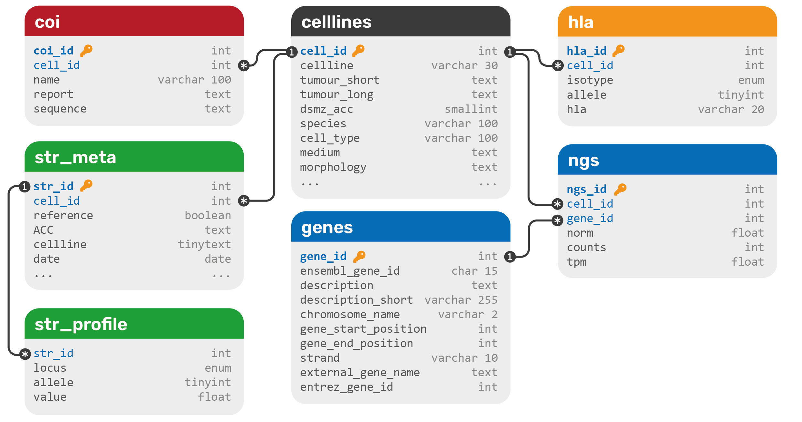

# DSMZCellDive

## About the programming
Simple web page with an PHP Router function (`php/Router.php`) and connection to a MySQL database (`php/_db.php`). Frontend is completely JavaScript with jQuery as UI-Framework. Plots are generated with [Plotly.js](https://plotly.com/javascript/). No magic involved. 

## About the content

Content was extracted from CSV, TSV and Excel files using self-written Python scripts. It was converted to a MySQL database comprising the following schema:

